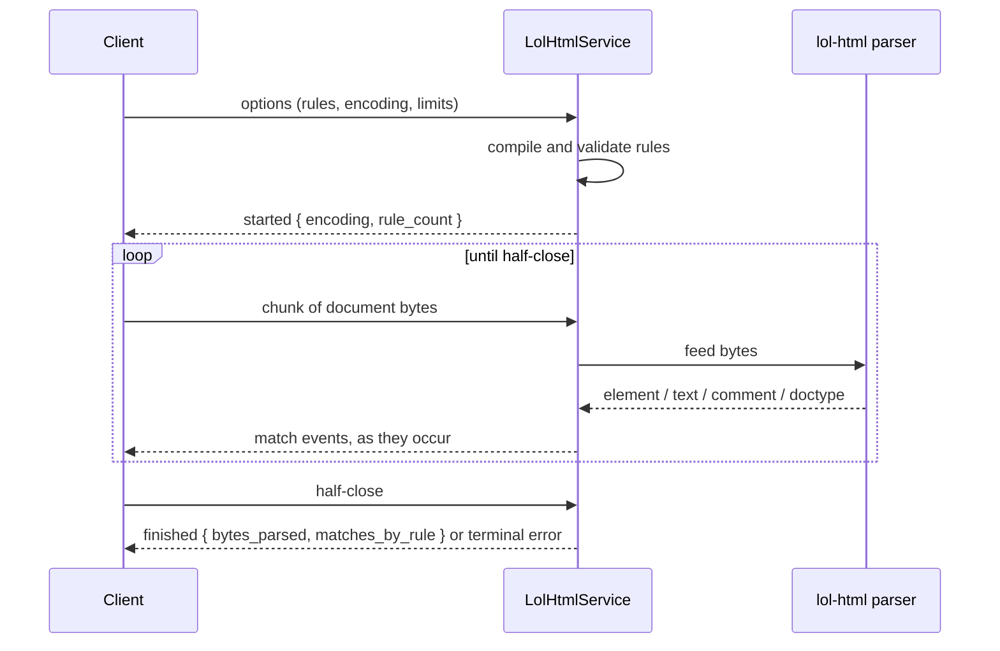

# grpc-lol-html

A gRPC server that streams CSS-selector matches out of HTML, parsed with
[lol-html](https://github.com/cloudflare/lol-html), Cloudflare's streaming
rewriter and the engine behind Workers' `HTMLRewriter`.

```bash
cargo run --release
# grpc-lol-html listening on 0.0.0.0:50051 (http2 window 4194304 bytes)
```

## What it is

You send HTML chunks. It sends back what matched, as it matches.



```
client ->  [0] options { rules: [{ id: "links", selector: "a[href]", captures: [ATTRIBUTES] }] }
client ->  [1] chunk (64 KiB)
server <-        started   { encoding: "UTF-8", rule_count: 1 }
server <-        element   { rule_id: "links", attributes: [href="/about"] }
client ->  [2] chunk
server <-        element   { rule_id: "links", attributes: [href="/contact"] }
client ->  half-close
server <-        finished  { bytes_parsed: 131072, matches_by_rule: { links: 2 } }
```

There is no `document_id` and no handle to close, and that is deliberate rather
than unfinished. The sibling [grpc-calamine](../grpc-calamine) service is
handle-based because a workbook is a random-access artifact: you upload it once
and read sheet 3, then sheet 1. lol-html is a forward-only transducer. Bytes go
in, events come out, nothing is retained, and there is no document to go back
to. Wrapping it in a handle store would mean holding the whole document
server-side and re-parsing per read, which throws away the one property the
library exists for.

So server memory stays flat regardless of document size, and **the first
matches arrive before the last byte has been uploaded**. Both are tests rather
than claims. `matches_arrive_before_the_upload_is_finished` in
`tests/extract.rs` holds the second half of a document back and still demands
its match, and `tests/memory.rs` watches the real server binary's peak RSS
while feeding it successively larger documents:

```
  document      1 MiB    16 MiB    64 MiB   128 MiB   256 MiB
  peak RSS     13 MiB    22 MiB    24 MiB    26 MiB    27 MiB
```

256 times the document for twice the memory, and nearly all of that is the
first step, where a freshly started process touches its buffers for the first
time. Retaining documents would have put the last column at 260 MiB.

You can also watch it happen. `demos/node-client` has a web viewer that POSTs a
document and reads the events off the same response, drawing matches as they
land and marking the byte where the first one arrived:

```bash
cargo run --release &
cd demos/node-client && npm install && npm start   # http://127.0.0.1:8080
```

> First match after **48 B of 305 B** (16% uploaded). The rest of the document
> had not been sent yet.

## Configuration

All optional, read at startup:

| Variable | Default | Effect |
|---|---|---|
| `GRPC_LOL_HTML_ADDR` | `0.0.0.0:50051` | listen address |
| `GRPC_LOL_HTML_WORKERS` | CPU count | tokio worker threads |
| `GRPC_LOL_HTML_MAX_CHUNK_BYTES` | 100 MiB | largest inbound chunk accepted |
| `GRPC_LOL_HTML_WINDOW_BYTES` | 4 MiB | HTTP/2 initial stream and connection window |

## Where you split the upload is invisible

Chunk size is a throughput knob and nothing else. `tests/extract.rs` replays
every fixture at 1, 3, 7, 64, 1024 and whole-document chunk sizes and compares
the resulting event streams **in full**: every field, including byte spans and
the final `bytes_parsed`.

This is the load-bearing test, and it earned its keep: it is what caught both
of the upstream problems described under "Two things lol-html gets wrong",
below. Neither was visible from reading the library's documentation.

## The five things clients get wrong

### 1. Text chunks are not text nodes

lol-html splits text at buffer boundaries, so one paragraph can arrive as any
number of fragments with `last_in_text_node()` marking the real end. Consuming
those directly gives you a client that looks perfect in testing and cuts words
in half in production, at document sizes you did not test.

The server reassembles by default and emits one `text` event per text node.
Set `raw_text_chunks` if you want the fragments, which keeps server memory
constant even for a single enormous text node; concatenating a node's fragments
in order reproduces the reassembled text exactly.

### 2. It does not run JavaScript

No engine, no DOM, no fetching of `<script src>`. This is a tokenizer, and
whatever the server sent is what you get.

It does extract script *source*, which is the useful half: structured data
lives in `<script type="application/ld+json">` on most commercial pages, and a
selector reaches it. Price, availability and rating without a browser.

The limit that follows is real. On a client-rendered app the content is not in
the HTML at all: `sample-data/spa_shell.html` yields the string `Loading…` and
nothing else, because the `<div id="root">` is filled by a bundle this service
will never run. If you need the post-JavaScript DOM, render it with a headless
browser first and feed the result here.

### 3. Not all text is prose

`TextType` distinguishes six kinds of text, and a client that concatenates
every text event indexes minified JavaScript and CSS as body copy.

The default filter is `[DATA, RCDATA]`: prose, plus the `<title>` and
`<textarea>` contents that are also entity-decoded. Ask for `SCRIPT_DATA` or
`RAW_TEXT` by name if you want them. Only `DATA` and `RCDATA` are
entity-decoded, so the rest arrive exactly as written.

### 4. Ambiguous markup is refused, not guessed

On markup like `<select><xmp><script>` lol-html declines to pick a parse,
because picking wrong is what turned Cloudflare's own security features into
[XSS gadgets](https://portswigger.net/blog/when-security-features-collide). It
arrives as a typed terminal `error` event; everything emitted before it stands.

The escape hatch is `allow_ambiguous_markup`, deliberately phrased as an opt-in
to the unsafe behaviour rather than as lol-html's own `strict` flag. proto3 has
no field presence for bools, so a `strict` field would arrive as `false` from
every client that had not heard of it, and the safe behaviour has to be the
zero value. Conforming markup never triggers the bail-out.

### 5. Send the options frame before you await the response

The server validates options before opening the response stream, so it emits no
response headers until it has them. A client that feeds the request from a
queue and awaits the call *first* will wait forever. Clients that build the
request as an iterator never notice.

## Selectors: what compiles and what does not

Wider than "no tree, no selectors" suggests, and the line is worth knowing.

**Supported.** `*`, `E`, `E F`, `E > F`, `.class`, `#id`, `:not(s)`, every
attribute operator including `^=` `$=` `*=` `~=` `|=` and the `i`/`s` case
flags, plus `:nth-child(n)`, `:first-child`, `:nth-of-type(n)` and
`:first-of-type`.

**Rejected, because the answer lies in markup not yet read.** `:last-child`,
`:only-child`, `:nth-last-child(n)`, `:last-of-type`, `:only-of-type`,
`:has(s)`.

**Rejected as unimplemented.** The sibling combinators `+` and `~`.

**Rejected as meaningless in a token stream.** Namespaced selectors (`svg|a`)
and pseudo-elements (`::before`).

`:first-child` against `:last-child` is the whole idea: an element is known to
be first the moment it is seen, and cannot be known to be last until its parent
closes. None of these are pending work.

`ValidateSelectors` compiles a rule set and returns typed diagnostics without
sending a document. One cheap round trip, and selector mistakes are the most
common way to get an empty result out of this service.

## Safety

**Memory is capped whether or not you ask.** lol-html defaults
`max_allowed_memory_usage` to `usize::MAX`; a server taking documents off the
open web must not run that way, so an unset or zero `limits.max_bytes` means
64 MiB rather than infinity. Exceeding it is a typed error, or a truncated
success carrying `bailed_out` if you set `graceful_bail_out`. Either way the
process survives, which
`a_document_over_its_memory_cap_fails_in_band_and_the_server_survives` checks
by streaming a second document through afterwards. The cap bounds parser state;
what keeps total memory flat is that nothing is retained, which is the table
above.

**UTF-16 is refused up front.** lol-html's tokenizer scans for ASCII markup
bytes, so UTF-16LE/BE, ISO-2022-JP and `replacement` are rejected with
`INVALID_ARGUMENT`. Transcode first.

**Chunk size is capped** at 100 MiB, tunable with
`GRPC_LOL_HTML_MAX_CHUNK_BYTES`. This is not a document size limit; a document
is any number of chunks and has no ceiling. It bounds how much one message
carries, and so how long a single uninterruptible parse can hold an async
worker. tonic's own decoding limit is derived from it at twice the value,
deliberately above rather than equal, so an ordinary overshoot gets the
`INVALID_ARGUMENT` that names the limit rather than the transport's
`OutOfRange`.

Sending a chunk that large is allowed but pointless. The benchmark plateaus
around 256 KiB: 16 KiB against 1 MiB is roughly 85 against 96 MiB/s, and above
that nothing improves while the per-call buffer grows.

## Two things lol-html gets wrong

Both found by the chunk-size invariance test, both worked around at the
boundary rather than passed on to clients.

**Bare attribute source locations are unusable.** For an attribute written
without a value, lol-html reports a position that varies with chunking and can
point at bytes belonging to a different part of the tag. Reproduced directly
against the library on `<script SRC="/a.js" DEFER async>`:

```
chunk 8:   defer: name=Some(33..38)  value=Some(13..13)
chunk 64:  defer: name=None          value=None
```

Byte 13 is the start of `<script`. A real value always begins after its own
name ends, so the server drops any name/value span pair where it does not, and
bare attributes therefore carry no spans at all. `foo=""` is a real location
and keeps its spans.

**`Doctype::force_quirks()` is not public API.** lol-html computes it but gates
the accessor behind its internal `_integration_test` feature. The field number
is reserved in the proto rather than shipped always-false, so it can come back
unchanged if that accessor is ever exposed.

## Is it fast

Faster over the wire than building a DOM in the same process:

```
  arm                                best        MiB/s  vs native
  in-process lol-html               49.3ms          324      1.00x
  over gRPC                        129.7ms          123      2.63x
  scraper (html5ever + DOM)        168.1ms           95      3.41x
```

16 MiB synthetic page, 135,426 matched elements, 7 interleaved iterations on a
32 core host. You pay about 2.6x against in-process lol-html for serialization
and a socket, and still beat html5ever with a DOM, which pays no transport cost
at all. Ratios are unchanged at 64 MiB.

`bench/` refuses to print numbers unless the arms agree: every matched element
folds into an order-sensitive digest, and in-process and over-the-wire must be
byte-identical. Use 256 KiB upload chunks; throughput plateaus there and buys
nothing above 1 MiB. See [bench/RESULTS.md](bench/RESULTS.md), including two
hypotheses about where the cost goes that turned out to be wrong.

## Building

```bash
cargo build --release
cargo test                                              # 43 tests
cargo clippy --all-targets --all-features -- -Dwarnings
buf lint && buf build
buf generate                                            # regenerate src/gen
buf build -o src/gen/file_descriptor_set.binpb          # regenerate the reflection descriptor set
demos/compare-clients.sh                                # needs a running server
```

The server also exposes gRPC reflection (v1) from a `FileDescriptorSet` checked
in at `src/gen/file_descriptor_set.binpb`: the same `buf build` output, kept
next to the generated Rust since codegen runs through buf rather than a
build.rs. Rebuild it after any proto change; with it, clients such as
`grpcurl -plaintext localhost:50051 list` need no local .proto files.

MSRV is 1.88, set by tonic 0.14 rather than by lol-html, which builds on 1.85.

The contract is the deliverable: see
[`proto/lolhtml/v1`](proto/lolhtml/v1), whose comments document every field.
`buf lint` enforces a comment on every message, enum, field, oneof and RPC.

## Not here yet

**Rewriting.** lol-html rewrites as well as it reads, and `Rewrite` will be a
second RPC on the same service carrying declarative mutations that map onto
lol-html's `Element` methods. Adding an RPC is additive, which is why the
service is named for the library rather than for `Extract`: a service name is
baked into every method path and is the one thing here that cannot be changed
additively later.

**An html5ever backend.** Deliberately not reserved as a `backend` field.
html5ever builds a tree, so it structurally cannot emit events before the
document ends, and a field implying a drop-in swap would quietly change the
streaming guarantee this contract is built on. If it lands it deserves its own
RPC that is honest about buffering.
